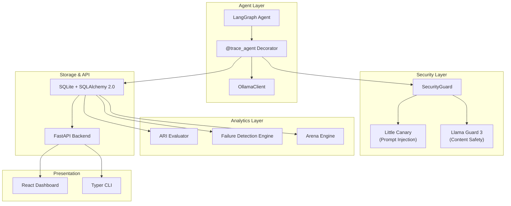

<p align="center">
  
</p>

<h1 align="center">ORBIT</h1>

<p align="center">
  <strong>Local-first observability, replay & security for AI agents</strong>
</p>

<p align="center">
  <em>Run any local AI agent and immediately understand why it succeeds, fails, or becomes unsafe — entirely on your own machine.</em>
</p>

<p align="center">
  <a href="https://github.com/samvitgersappa/orbit/actions/workflows/ci.yml">
    
  </a>
  <a href="https://github.com/samvitgersappa/orbit/blob/main/LICENSE">
    
  </a>
  
  
  
  <a href="https://github.com/samvitgersappa/orbit/stargazers">
    
  </a>
</p>

<br/>

<p align="center">
  <a href="#-quick-start">Quick Start</a> •
  <a href="#-features">Features</a> •
  <a href="#-architecture">Architecture</a> •
  <a href="#-cli-reference">CLI</a> •
  <a href="#-dashboard">Dashboard</a> •
  <a href="#-contributing">Contributing</a>
</p>

---

## Why ORBIT?

Modern LLM agents are powerful but **opaque**. When a workflow fails, hallucinates, or leaks sensitive data, debugging is painful. Cloud-based observability tools require sending your prompts and data off-device.

**ORBIT** is the **LangSmith alternative that runs entirely on your laptop:**

| | Cloud tools | ORBIT |
|---|---|---|
| **Data privacy** | Your prompts leave your machine | 🔒 Everything stays local |
| **Cost** | Per-trace pricing | 🆓 Free & open-source |
| **Setup** | API keys, accounts, dashboards | ⚡ `uv sync && orbit serve` |
| **Security scanning** | Manual / separate tool | 🛡️ Built-in, every call |
| **Model comparison** | Run separately, compare manually | 🏟️ Agent Arena, side-by-side |

---

## ✨ Features

### 🔍 Deep Tracing
Capture every LangGraph node execution, Ollama LLM call, tool invocation, and error — with full prompt/response logging and latency tracking.

### 🔁 Failure Replay
Reconstruct any agent run step-by-step. Visualize the execution as an interactive graph with ReactFlow. Pinpoint exactly where and why failures occur.

### 📊 Agent Reliability Index (ARI)
A quantitative **0–100 score** for every run, composed of:
- **Task Success** (40%) — Did the agent complete its goal?
- **Tool Accuracy** (25%) — How many tool calls succeeded?
- **Hallucination Score** (20%) — Did the agent reference non-existent tools?
- **Latency Score** (15%) — How fast was the response?

Buckets: **Excellent** (85–100) · **Good** (70–84) · **Fair** (50–69) · **Poor** (0–49)

### 🏟️ Agent Arena
Pit models against each other on the same task:
```bash
orbit battle --task "implement quicksort" --models llama3.1 qwen2.5
```
Compare ARI, latency, tool accuracy, and success rates. Persistent leaderboards in the dashboard.

### 🛡️ Security Guard
Every LLM call is scanned for:
- **Prompt injection / jailbreak** — via [Little Canary](https://github.com/bpb-innovations/little-canary) (local)
- **Unsafe content** — via Llama Guard 3 (served by Ollama)
- **OWASP LLM Top 10** categorization of all findings

### 📈 React Dashboard
Full observability dashboard with Overview, Runs, Failures, Arena, Replay, Models, Analytics, and Security pages — built with React 19, TypeScript, Tailwind CSS, shadcn/ui, and Recharts.

---

## 🚀 Quick Start

### Prerequisites

- **macOS** on Apple Silicon (M-series) — tested on M4, 16 GB RAM
- **Python 3.12+**
- **Node.js 20+**
- [**Ollama**](https://ollama.com) installed and running
- [**uv**](https://github.com/astral-sh/uv) package manager

### Install

```bash
# Clone the repo
git clone https://github.com/samvitgersappa/orbit.git
cd orbit

# Install Python dependencies
uv sync

# Pull required Ollama models
ollama pull llama3.1
ollama pull llama-guard3

# Install frontend dependencies
cd frontend && npm install && cd ..
```

### Run

```bash
# Terminal 1: Start the backend
uv run orbit serve

# Terminal 2: Start the frontend
cd frontend && npm run dev

# Terminal 3: Trace an agent
uv run orbit trace src/orbit/examples/coding_agent.py
```

Open **http://localhost:5173** to view the dashboard.

### Docker (One-Command)

```bash
docker compose up
```

---

## 🏗️ Architecture



> For a deep dive, see [docs/architecture.md](docs/architecture.md).

---

## 💻 CLI Reference

| Command | Description |
|---|---|
| `orbit serve` | Start the FastAPI backend server |
| `orbit trace <path>` | Run and trace an agent script |
| `orbit replay <run_id>` | Replay a run's execution timeline |
| `orbit battle --task "..." --models m1 m2` | Run Agent Arena to compare models |
| `orbit report <run_id>` | Print ARI breakdown & failure summary |
| `orbit runs` | List recent runs |
| `orbit models` | List available models |
| `orbit security <run_id>` | Show security events for a run |

---

## 📊 Dashboard

The ORBIT dashboard provides real-time insights across 8 pages:

| Page | What it shows |
|---|---|
| **Overview** | Total runs, avg ARI, success rate, security alerts |
| **Runs** | Filterable table of all agent executions |
| **Failures** | Failures grouped by type with root cause analysis |
| **Arena** | Model leaderboard ranked by ARI |
| **Replay** | Interactive execution graph with timeline scrubbing |
| **Models** | Available Ollama models + usage stats |
| **Analytics** | ARI distribution, latency charts, tool usage |
| **Security** | OWASP category breakdown, per-run security summary |

---

## 🛠️ Tech Stack

| Layer | Technologies |
|---|---|
| **Backend** | Python 3.12 · FastAPI · Pydantic v2 · SQLAlchemy 2.0 (async) · SQLite via aiosqlite |
| **Frontend** | React 19 · TypeScript · Vite · Tailwind CSS · shadcn/ui · Recharts · ReactFlow |
| **Agent** | LangGraph · Ollama (llama3.1, qwen2.5, gemma3) |
| **Security** | Little Canary · Llama Guard 3 |
| **CLI** | Typer |
| **DevOps** | uv · Docker · GitHub Actions · ruff · mypy · pytest |

---

## 🤝 Contributing

We welcome contributions! Whether it's fixing a bug, adding a feature, or improving docs — every contribution matters.

```bash
# Fork, clone, and set up
git clone https://github.com/<your-username>/orbit.git
cd orbit
uv sync --all-extras --dev
cd frontend && npm install && cd ..

# Run tests
uv run pytest
uv run ruff check .
uv run mypy src
```

See [**CONTRIBUTING.md**](CONTRIBUTING.md) for detailed guidelines.

### Areas Where Help is Wanted

- 🔌 **More API endpoints** — `/runs/{id}`, `/arena`, `/models`, `/metrics`, `/security/*`
- 🤖 **Example agents** — research_agent.py, retrieval_agent.py
- 🧪 **Tests** — unit tests for analytics, security, and replay engines
- 🎨 **Dashboard** — wire up live data, build out Arena and Replay pages
- 📦 **Framework support** — CrewAI, AutoGen integrations (Phase 2)

---

## 📋 Roadmap

See [docs/roadmap.md](docs/roadmap.md) for the full roadmap.

**Phase 1** (Current) — Core tracing, ARI, Arena, Security Guard, React dashboard
**Phase 2** — Multi-framework support, live replay, advanced Arena testing
**Phase 3** — PII redaction, benchmark suites, community plugins

---

## 📄 License

ORBIT is open-source under the [MIT License](LICENSE).

---

<p align="center">
  <strong>If ORBIT helps you debug your agents, consider giving it a ⭐</strong>
  <br/>
  <a href="https://github.com/samvitgersappa/orbit">
    
  </a>
</p>
